# FoodReviewPlatform

This is an **Angular** project that allows users to discover restaurants based on location, check in at places, write reviews.

## Development server

Run `ng serve` for a dev server. Navigate to `http://localhost:4200/`. The application will automatically reload if you change any of the source files.

## Build

Run `ng build` to build the project. The build artifacts will be stored in the `dist/` directory.

## Screenshots
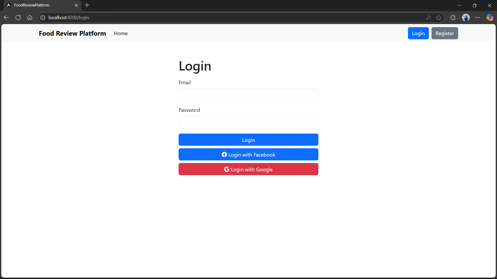

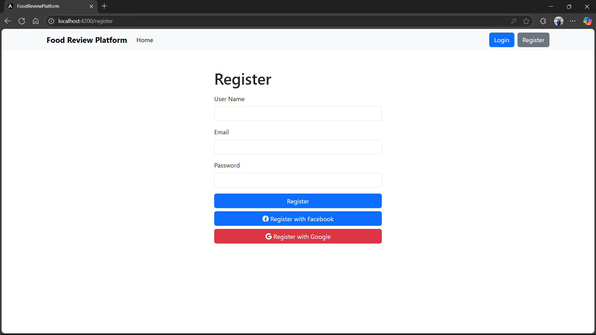

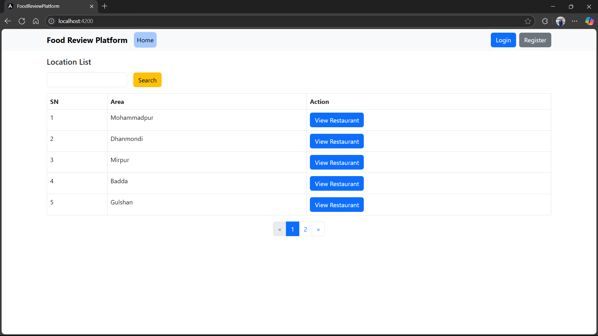

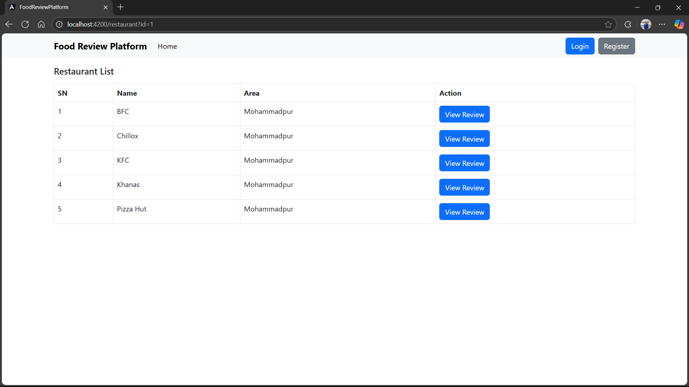

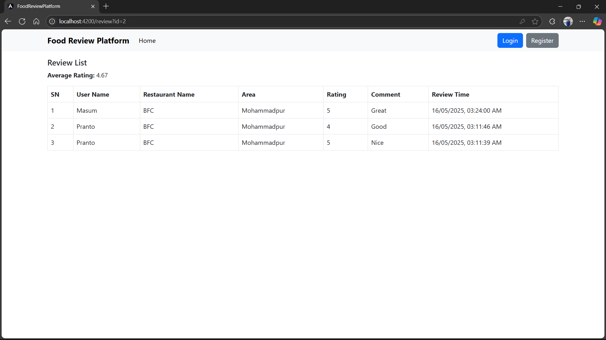

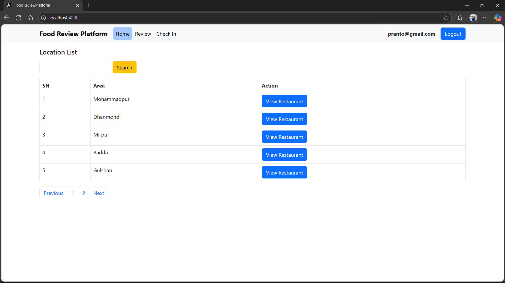

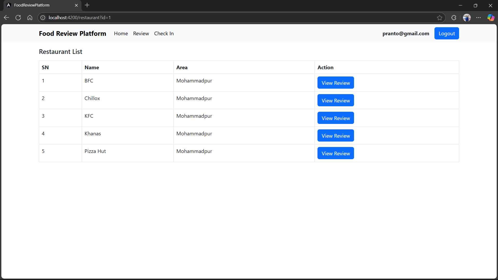

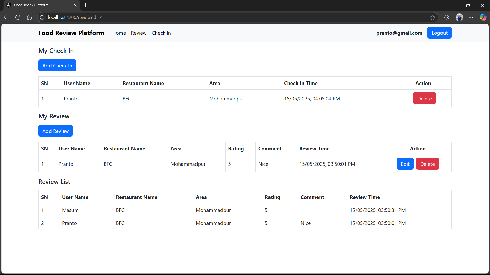

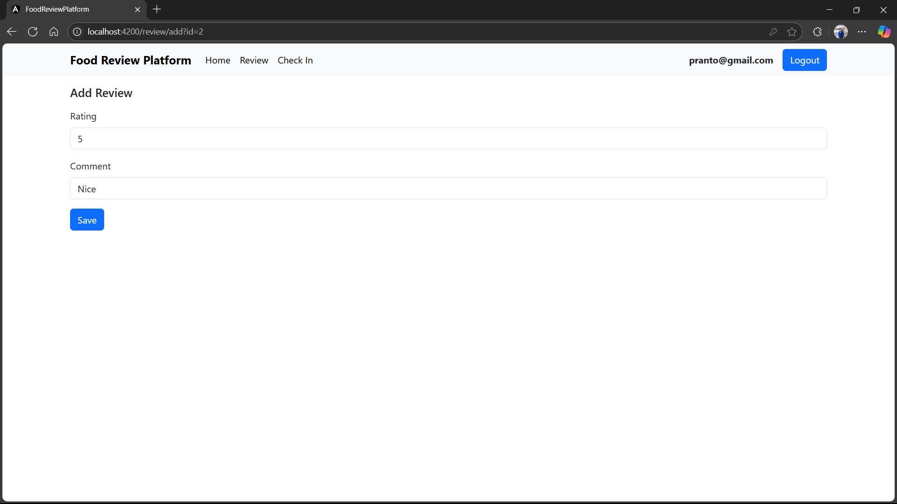

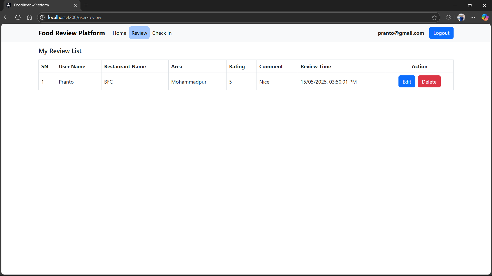

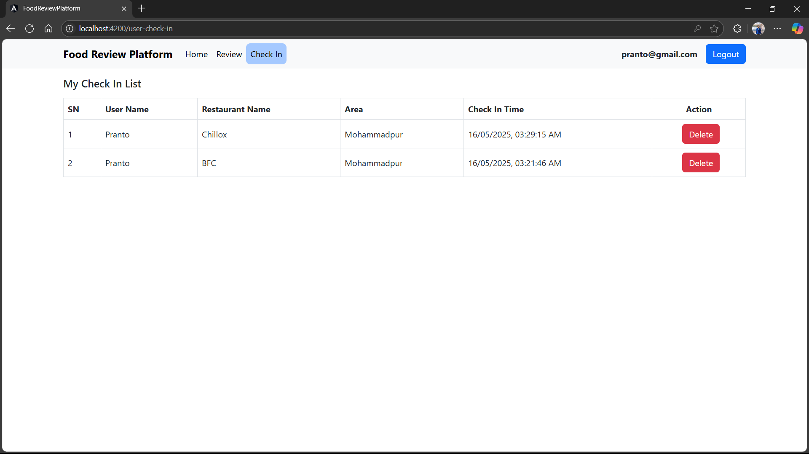
