# Food Review Platform

A web application to discover restaurants based on location, check in, and write reviews. The backend was implemented using C# ASP.NET Web API, following a monolithic architecture with the service repository pattern. Entity Framework Core used for database operations with PostgreSQL. Implemented user management with authentication and role based authorization using JSON Web Token (JWT). The frontend was developed with Angular, featuring reusable components, services, guards, interceptors, and pipes. Styled the user interface using Bootstrap for responsive design.


## Frontend Project

[food-review-platform](https://github.com/pranto1209/food-review-platform)

## Backend Project

[FoodReviewPlatform](https://github.com/pranto1209/FoodReviewPlatform)


## Screenshots

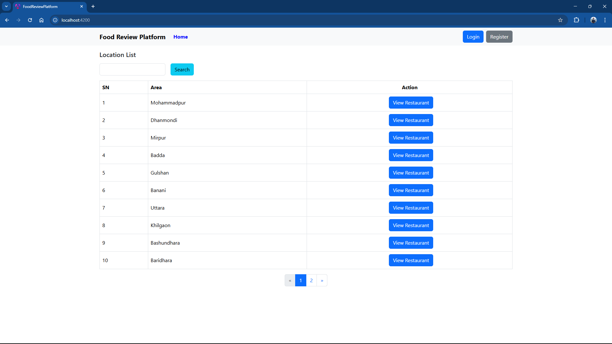

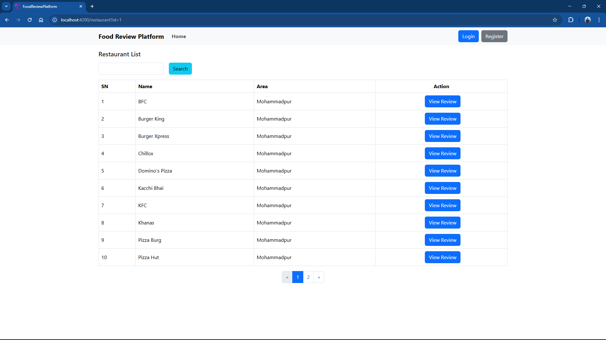

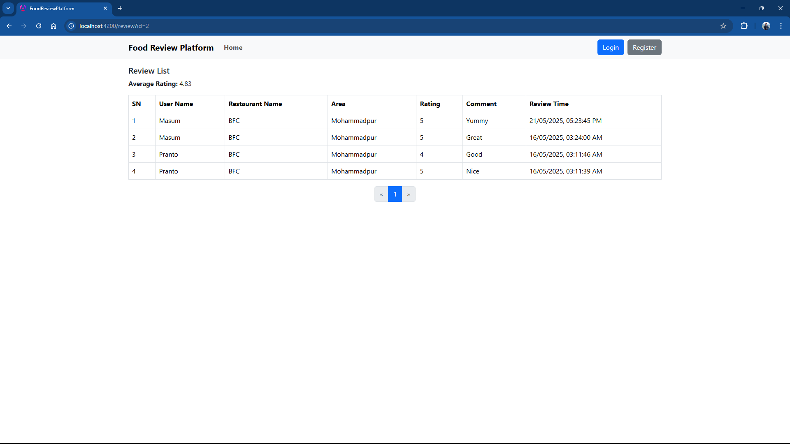

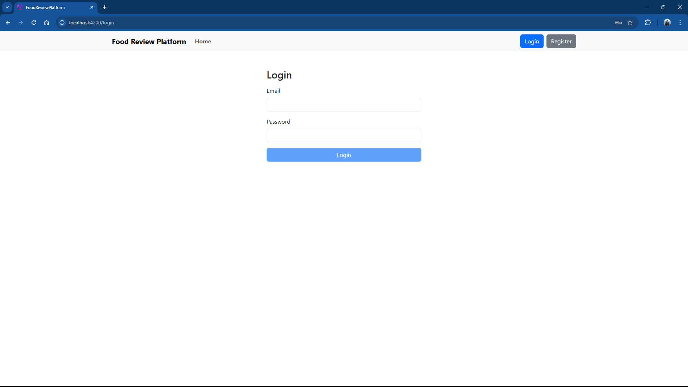

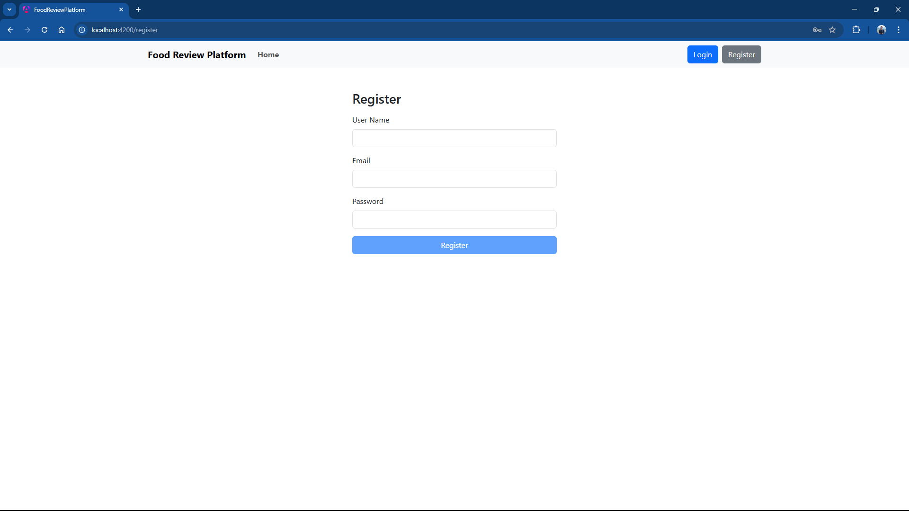

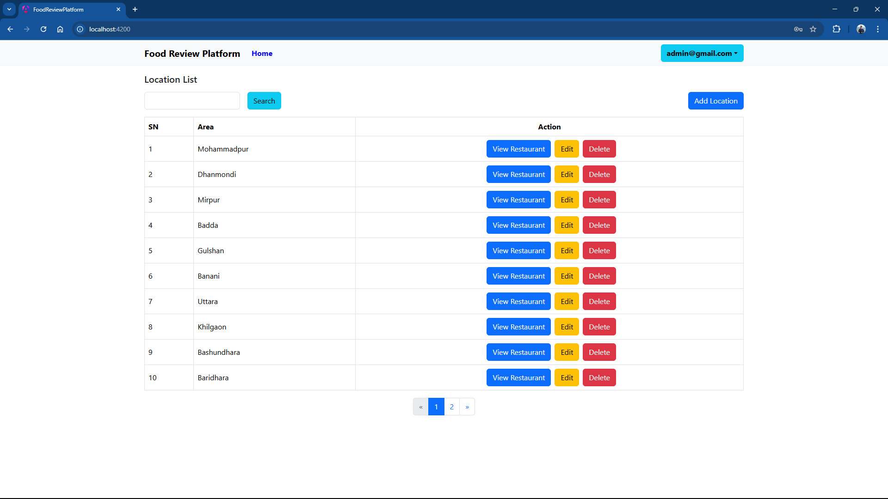

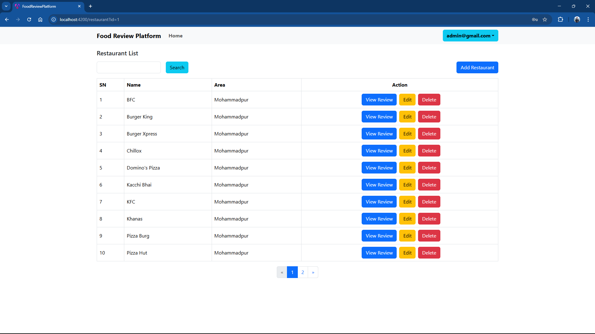

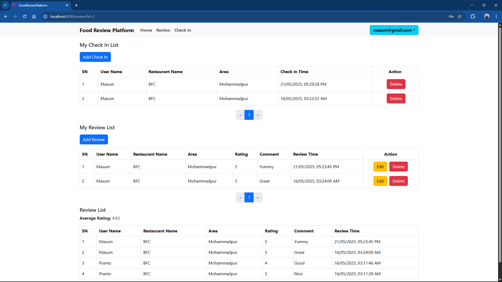

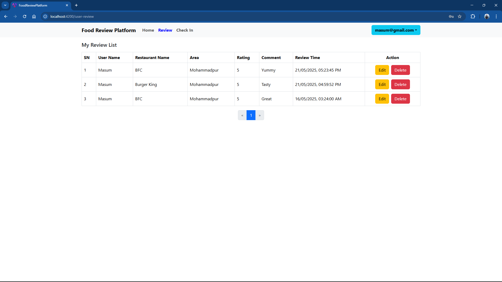

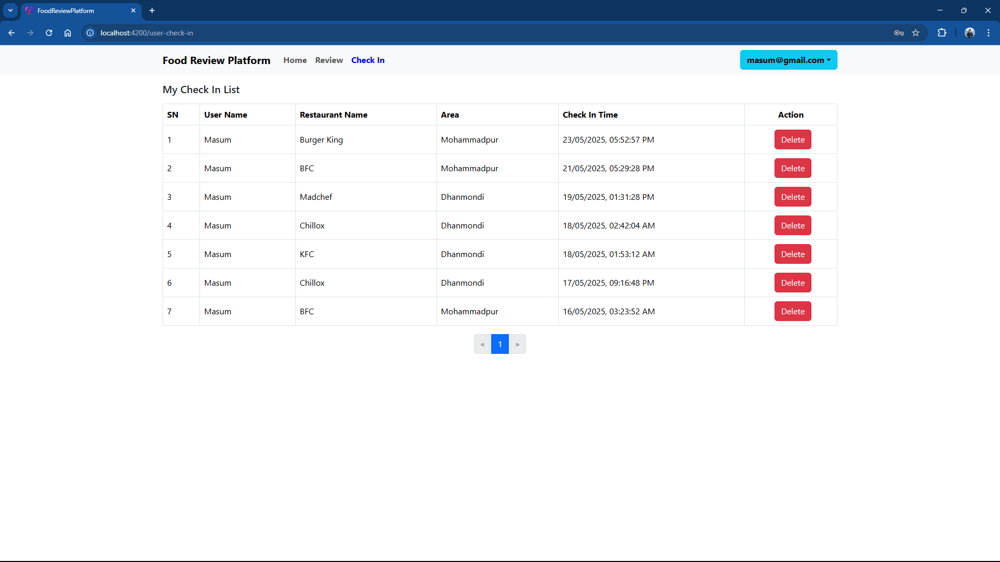

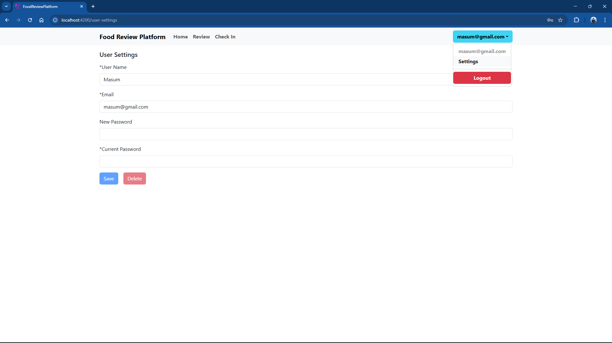


## Development server

To start a local development server, run:

```bash
ng serve
```


## Building

To build the project run:

```bash
ng build
```
